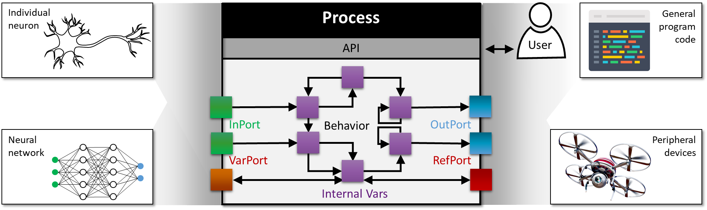
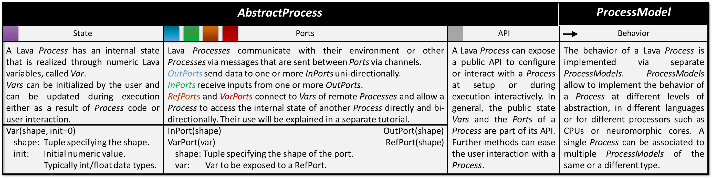
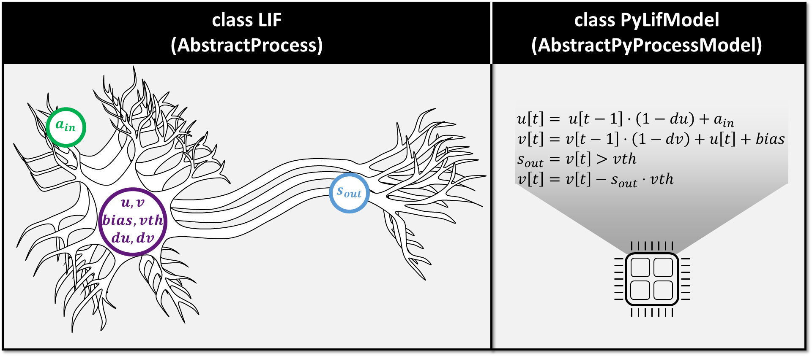
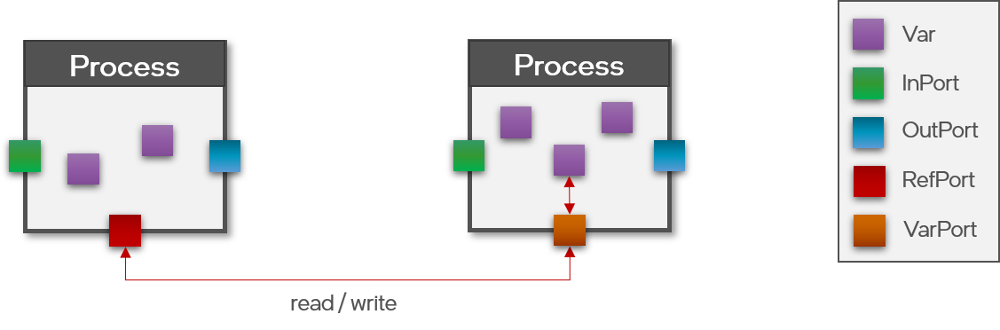
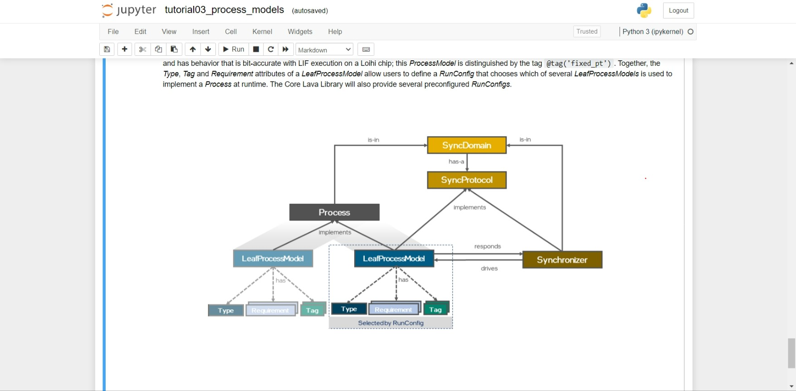
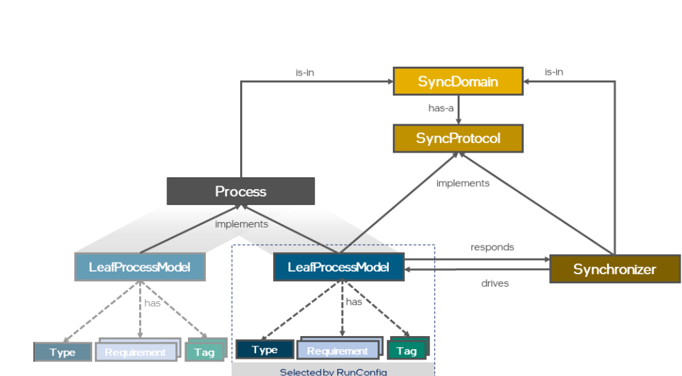
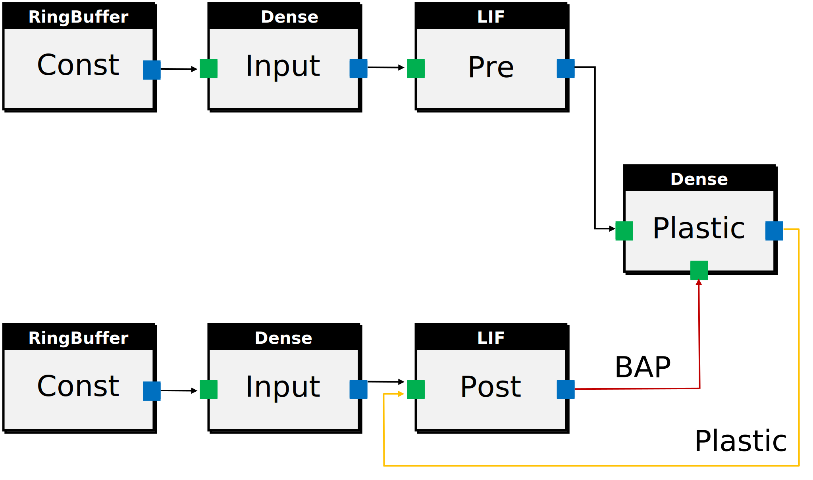
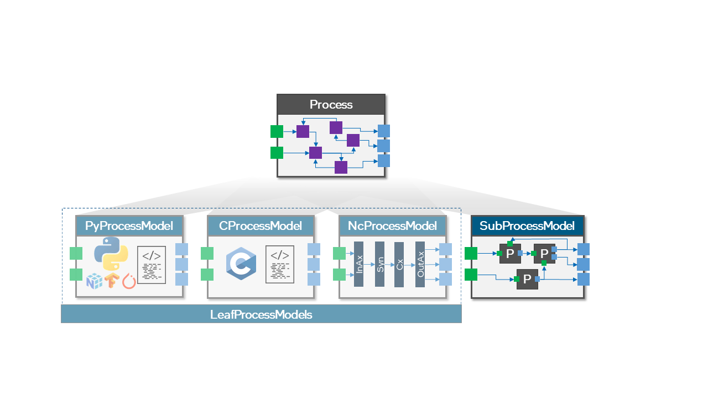
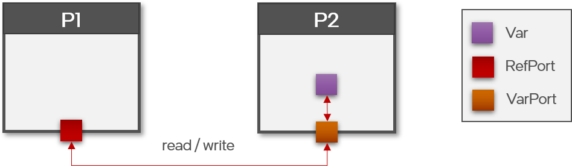

<h1 align="center">
      Guide for the Tutorial 
      Headless Linux for Hardware: Navigating the Intel Loihi Superhost 
</h1>

<h3 align="center">
    Russell Jarvis post-doctoral researcher at ICNS.
    r.jarvis@westernsydney.edu.au
</h3>

### Take Home Assessment

* Submit tutorial1 and tutorial2 as one complete final written report document using Markdown for typesetting due in 1 weeks.

* Weight: `30%` Type of Collaboration: Individual Submission: Weeks 9 by Friday 11:59pm (midnight) Turnit in, or optionally Markdown file or jupyter notebook on Github (just like this file, iself).

### Format
* The report will consist of 1000−1200 words and several figures. This report aims to demonstrate the completion of assigned pre works and labwork in programming Loihi. Use markdown typesetting, and submit the final report using github assignments.

* References, quotes, and appendices are not part of the word count. Length: 1200 words. You can include screenshots from todays Intel ssh experience, you can also paste BASH commands and Python code directly into markdown cells.

* Note that today's tutorial is the harder of the two tutorials, but the technical skills taught today are the foundation for next Week's tutorial.


### House Keeping on Last Weeks Tutorial


Now make four copies of the file:
`cp lava_test.py bigger_lava_test0.py`
`cp lava_test.py bigger_lava_test1.py`
`cp lava_test.py bigger_lava_test2.py`
`cp lava_test.py bigger_lava_test3.py`

Edit these four different files in-order to reflect these four different conditions:

In your markdown report make a table like the following:

|       | Hardware |  CPU simulation |
| ----------- | ----------- | ----------- |
| layer size  1   | profile execution speed  |  profile execution speed   |
| layer size  100  | profile execution speed |  profile execution speed  | 

... and populate the table by filling in the appropriate profile execution speed


## Exercise Overview:
By the end of todays tutorial you can say that you have edited an online app...
and by the end of the week you can say you have used GitHub to deploy your own version of said web-app.


Both of todays exercises are worth 7.5 marks each in total.

<summary> <h4> For Exercise 1. </h4> <summary>

<details>

As I said before I encorouge you to submit the final report as a markdown document, as markdown editing ability will prove useful in todays streamlit application, and later on in your research careers.


We will look at two pre-existing Unit test files in the lava-loihi tests directory, run the two files to completion. We will comment out any method decorators that look like they would stop test execution.

#### Readability Comments.
Your main job task is to run the pre-existing unit tests and write readability-comments to explain the function of particular lines of code. 
When you have commented the unit tests, you can copy particular unit test file lines of code, including your read-ability comments, and paste them into the final markdown report document. Please also copy the name of the file you are commenting.

### For Exercise 2.
We are going to go into some pre-existing app code, that simulates biologically plausible echo state networks. The analysis of the networks is already very complete, however to compliment our understanding of how the information in the network behaves we will compute a spike time irregularity metric.
in the network, but the CV is very simple to implement and understand.

</details>
<summary> Back to Linux on the Intel Cloud Environment </summary>
<details>

### Lets Visit Intel Cloud/Superhost Again.
Using last weeks alias do:
```BASH
intel
```

### SLURM Zombies, and regular Linux Zombies.

You can easily create zombie processes by putting unhaltable code in the background, and then logging out of a resource. Your job we will keep running there in the background.

* How to kill your zombie processes:
  * SLURM `scancel`.
  * Linux everywhere else: `top`, and `kill`.

If you have created a zombie process you can find its job id with:
```
top
```
Top prints out a table with process id's in the left hand column. You can kill the zombie process, by running `scancel`, in this context scancel behaves like the `kill` on command on desktop linux.

### More aliases to speed up Linux CLI Experience.

An alias for history 
```bash
alias h='history'
```
An alias to edit ~/.bash_profile in nano:
```bash
alias bpn='nano ~/.bash_profile'
```


### Exercises

When logged into Intel Super Host Run:

```
cd ~ # or $HOME (its the same thing).
cp /nfs/ncl/lava/releases/v0.4.0/lava-nc-loihi-0.4.0.tar.gz .
tar -xzv lava-nc-loihi-0.4.0.tar.gz

```
* activate the lava virtual environment using the alias you defined in lab1.
or just do ```bash source lava-nc/bin/activate```

* On your laptop run:

```BASH
cd $HOME

scp ncl-edu.research.intel-research.net:/nfs/ncl/lava/releases/v0.4.0/lava-nc-loihi-0.4.0.tar.gz .
tar -xf lava-nc-loihi-0.4.0.tar.gz
cd lava-nc-loihi-0.4.0
cd tests/lava/integration
code test_integration_uc_lif_dense_lif.py

```
</details>


#### Background

<summary>
Lava Processes
</summary>
<details>
Processes are independent from each other as they primarily operate on their own local memory while they pass messages between each other via channels. 

Different Processes thus proceed their computations simultaneously and asynchronously, mirroring the high parallelism inherent in neuromorphic hardware. 

A Lava Process can run across different backends such as a CPU, a GPU, or neuromorphic cores. Lavaa can thereby run some Processes on Loihi Neuro-cores in parallel with other processes run on embedded or conventional CPUs and or GPUs.
</details>

#### Background
<summary> Function Decorators </summary>
<details> Function decorators are a way of applying or inserting extra hidden code to pre-existing methods. The hidden code is inserted into the method at run-time.

Decorator requires LMT (Lakemount CPU)
```python
@implements(proc=Injector, protocol=LoihiProtocol)
@requires(LMT)
```

</details>
nc means neuro-core.

<summary> Typical Lava patterns </summary>
<details>

* setup an input layer, a weight layer (dense), and an output layer. 
* Use ports to connect-up layer inputs and outports.
* Ports are uni-directional `s_in` is input `a_in` is output.

```python
        # Reshape the matrix to a different set of dimensions.
        weights = (np.arange(in_size * out_size).reshape(out_size, in_size) + 1)
        bias = 10 * np.ones(in_size, dtype=np.int32)

        input_lif = LIF(shape=(in_size,),
                        du=0,
                        dv=0,
                        bias_mant=bias,
                        bias_exp=6,
                        vth=20)
        output_lif = LIF(shape=(out_size,),
                         du=4096,
                         dv=4096,
                         vth=1024)
        dense = Dense(weights=weights)

        input_lif.s_out.connect(dense.s_in)
        dense.a_out.connect(output_lif.a_in)
        ###
        # Notice the SyncDomain is specified as neurocore.
        ###
        nc_domain = SyncDomain("nc", LoihiProtocol(), [input_lif, dense,
                                                       output_lif])
 ```

```python
py_process = RingBuffer(**py_params)
spikes_computed = py_process.data.get()
```
</details>
#### Exercise 

Comment out any decorators that look like this:

`@unittest.skip`
`RUN_IT_TESTS=1`
unless it says: `@skipUnless(run_it_tests, "")` as we launch Python with the argument `RUN_IT_TESTS=1`, this argument is visible to the Unit test function decorator.

```python
#@unittest.skipUnless(run_it_tests, "") ```


``` BASH
cd lava-nc-loihi-0.4.0
SLURM=1 LOIHI_GEN=N3B3 PARTITION=oheogulch RUN_LOIHI_TESTS=1 RUN_IT_TESTS=1 python -m unittest -v tests/lava/integration/test_integration_multi_layer_lif_dense_with_io.py
```

lava-nc-loihi-0.4.0/tests/lava/integration/test_integration_multi_layer_lif_dense_with_io.py


source lava_nx_env/bin/activate
```
SLURM=1 LOIHI_GEN=N3B3 PARTITION=oheogulch RUN_LOIHI_TESTS=1 RUN_IT_TESTS=1 python -m unittest -v tests/lava/integration/test_integration_multi_layer_lif_dense_with_io.py
```

### Background

#### Dense is the container type used to create weighted synaptic connections.

```python
in_size = 1
out_size = 1500
# weights are all 1
weights = np.ones((out_size, in_size)) * 2
bias = 10 * np.ones(in_size, dtype=np.int32)

input_lif = LIF(shape=(in_size,),
                du=0,
                dv=0,
                bias_mant=bias,
                bias_exp=6,
                vth=20)
output_lif = LIF(shape=(out_size,),
                  du=4096,
                  dv=4096,
                  vth=1536)
```

* A list of input cells `input_lif` and a list of output cells: `output_lif`, and connecting them together with the Dense container. Basically the dense container, upgrades the type of a numpy matrix.

* We can create a very simple set of neural pathways, by taking a uniform weight matrix. The input matrix is `1` by `1500`
```
```python
weights = np.ones((out_size, in_size)) * 2

```


<summary> Multiple Choice question, what is the connection type: 
</summary>

<details>
(a) all-to-all,
(b) many-to-one
(c) one-to-many
</details>


```python
dense = Dense(weights=weights)
input_lif.s_out.connect(dense.s_in)
dense.a_out.connect(output_lif.a_in)
for j in range(4): 
  input_lif.run(condition=run_cnd, run_cfg=run_cfg)
```

### Background:


<summary>
<h4> The Motivation for Processes and Ports: </h4>

<details>
What is a Process?
In general, a Process describes an individual program unit which encapsulates data that store its state, algorithms that describe how to manipulate the data, ports that share data with other Processes, and an API that facilitates user interaction. 

A Process can thus be as simple as a single neuron or a synapse, as complex as a full neural network, and as non-neuromorphic as a streaming interface for a peripheral device or an executed instance of regular program code.

Each process can be appropriately assigned to different CPU or threads. The code implementation of one process is seperated from other all other processes via encapsulation, but if one directly dependends on the results of another, as is often the case, as processes are designed to share messages between each other, by communication inputs and outputs and reference variables through ports,

... Thankfully message passing between processes is managed for us.


</details>


#### Talk through Basic Python Lava Code:

```python
# Instantiate Lava processes to build network
from lava.proc.dense.process import Dense
from lava.proc.lif.process import LIF
import numpy as np
# Execute process lif1 and all processes connected to it for fixed number of steps
from lava.magma.core.run_conditions import RunSteps
from lava.magma.core.run_configs import Loihi2HwCfg

# declare a layer of Leaky Integrate and Fire Neurons of size 1.
lif1 = LIF(shape=(1, ))
# declare a layer of random valued weights of size 1.
dense = Dense(weights=np.random.rand(1, 1))
# declare a layer of Leaky Integrate and Fire Neurons of size 1.
lif2 = LIF(shape=(1, ))
```



<!---->

#### Dense Layers:
a Dense Lava Process and ProcessModel that have the behavior of a dense set of synaptic connections and weights. The Dense Connection Process can be used to connect neural Processes.

#### Ports
 The port, a port is an abstraction layer around a Lava Process, that enables it to interact with the outside world.

```python

# Connect processes via their directional input and output ports
lif1.out_ports.s_out.connect(dense.in_ports.s_in)

###
# Maybe s_in is a non breaking mistake (unconventional), its usually `s_out`!
###

dense.out_ports.a_out.connect(lif2.in_ports.a_in)

lif1.run(condition=RunSteps(num_steps=10), run_cfg=Loihi2HwCfg())
lif1.stop()
```


**If you really want to get techical about directionality of ports consult the above diagram.**


**A Lava process can be a whole network, a single neuron, or a different chunk of regular Python code that controls a drone. All of these parallel processes can send messages with each other through their ports, they can also run in parallel and their execution can be synchronous or asynchronous**



**Lava Processes, inherit from AbstractProcess, or PyProcess. Just like other objects, internal variables are mostly hidden. Ports are readable and writeable variables.
A convention you will notice is that InPorts have the attribute `ProcessModel().a_in` and outputs spiking activity via OutPort `ProcessModel().s_out` (often this would write spike train outputs).**

<!--
-->


Magma is the proprietary core of Lava, it has the Loihi drivers. Lava is an abstraction layer that sits above Magma. Although magma is propietarary, as Intel Cloud users you can still view code that is closely coupled with Magma source code, and this is what we will do in the second half of todays tutorial.



*In the figure above you can see how all of the various Lava processes are coupled together with input ports (green) and output ports (blue)*

BAP (Backwards Action Potentials) are propogated through from the pre-synaptic LIF to the post-synaptic LIF via a plastic synapse population contained by the Dense data type.
<!----->



### Loihi Architecture Overview. 

#### The Lava task-graph.

In Lava design all of the different processes that make up a Network simulation, all of the processes are constructed togethor into a compute job task-graph. This is a bit similar to other parallel computing paradigms like Python Dask.

Calling run on a leaf-node (or root node) is sufficient to run the network comprised by the whole task-graph.


# Loihi supports graded spike amplitudes, and that makes certain things possible.
As I said in the previous tutorial, Loihi spikes are large and graded.


Ports are abstractions around processes. If a process has an in-port and an out-port it can be communicated with.


Suppose you are programming in a manner where you record spike times but not raw neuron voltages. 

In that case, you may not notice that the simulated membrane potential of a current-based Loihi neuron is unitless and swings between $[−100,000,99,999]$**. Remember that $[-90,-50] mV$ is a normal range of neuron membrane potential in biologically grounded models like the standard LIF model. On Loihi this range has been re-normalised to be $ [-2^{23}, 2^{23
  *Unusual property of vt(t) it has highly non-biological plausible values $ [-100,000, 99,999] mV$ is normal.

```python
self.assertListEqual(v_in, [640.0, 1280.0, 128.0, 640.0])
```
In the following code from file: test_integration_hc_lif_dense_lif.py
```python
input_lif_params = {'shape': (in_size,),
                    'dv': 0,
                    'bias_mant': bias,
                    'bias_exp': 6,
                    'vth': 20}
output_lif_params = {'shape': (out_size,),
                      'dv': 4096,
                      'vth': 1024}


self.assertListEqual(v_in, [640.0, 1280.0, 128.0, 640.0])
self.assertListEqual(v_out, [0.0, 0.0, 0.0, 640.0])

```


**Gotcha: Remember this diagram which just shows that voltages have unbiological range, and that spikes can be graded.**


### Exercises Continued...
#### In BASH:

#### Exercises:

<summary>

### Streamlit application Interactive Web application

</summary>

<details>
  I will provide boiler plate code and established packages that calculate spike time co-efficient of variation $CV$ and spike train distance.

  re-apply this template code on Loihi network simulator activity to regular periodic firing and irregular firing network activity. 

  For low and high variability of spike times, comment on the ability of neurons to encode information if each unique interspike interval represents a unique feature or property.

  * compute the inter-spike intervals of spike times.
    * If spike times are in an array, you want get the delta between spk_times[1]-spk_times[0], and spk_times[2]- spk_times[1], ..., spk_times[N]- spk_times[N-1].
      * Each of these deltas constructed from pairs will be the element of an array called ISI.
  * Compute the coefficient of variation of Interspike intervals of spike trains. var(ISI)/mean(ISI). This a measure of dispersal, ie spike interval irregularity.
  * get the mean CV of a population of cells.
  * Regular asynchronous spiking.

</details>


### Background:
<summary>

<h4> Reservoir Computing and Echo State balanced E/I networks. </h4>

Lava now supports STDP and "balanced" Excitatory/Inhibitory biological networks, however, whether any one can install and run them is a different question. I have managed the task of installing, these big packages using streamlit for you.
</summary>

<details>
Take the spike trains corresponding to cells 18 and 23 [](https://github.com/russelljjarvis/lava/blob/main/tutorials/end_to_end/tutorial02_excitatory_inhibitory_network.ipynb
) of the notebook. Flesch out the skeleton methods provided on [](https://github.com/russelljjarvis/lava/blob/main/app.py#L622-L636) to compute the Interspike Interval arrays and the Coefficient of Variation of the spike trains.

The $ ISI_{CV} $ is actually less useful than the auto-covariance measures calculated 

Use your GitHub account to invite yourself to streamlit-cloud aka streamlit share.


Streamlit-share is able to build applications from git repositories

You have both been granted administrative access to two different copies of the same repository lava. You should both edit the versions of the file app.py found in each of these two respective places:

Damien:
https://github.com/russelljjarvis/lava

Josh:
https://github.com/neuromorphicsystems/lava

These two repositories are stop gap locations that will serve you until you have streamlit-share accounts.

Edit the files in the web and flescht out the missing functions for computing $ CV_{ISI} $, caption the all of the raster plots in the app with the CV. Also edit figure call-outs into the application markdown discussion about the autocovariance. Discuss the auto covariance plot and how $ CV_{ISI} $ relates to the covariance plots. You can also plot the $ CV_{ISI} $ per-neuron as a vector.
</details>


