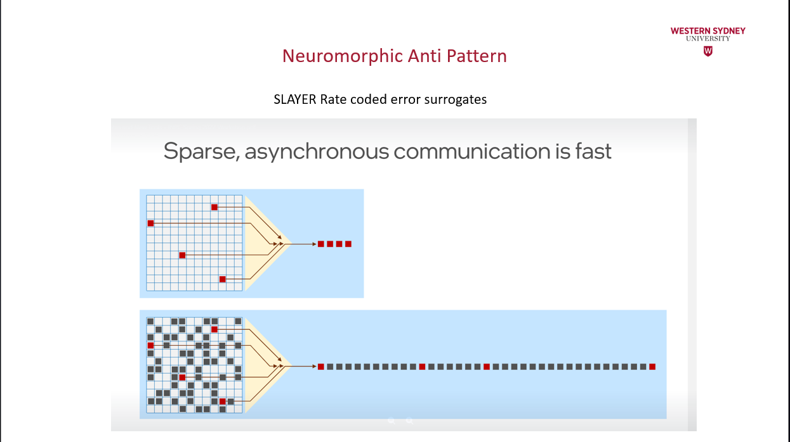
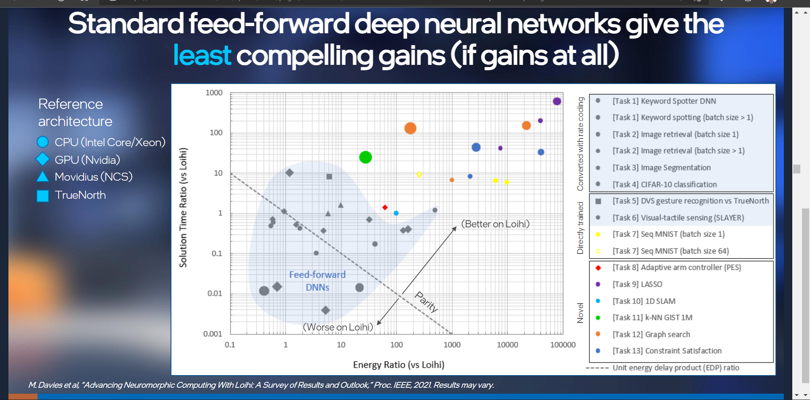
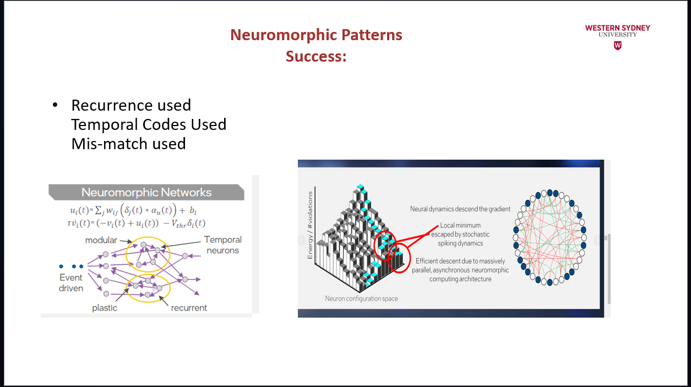
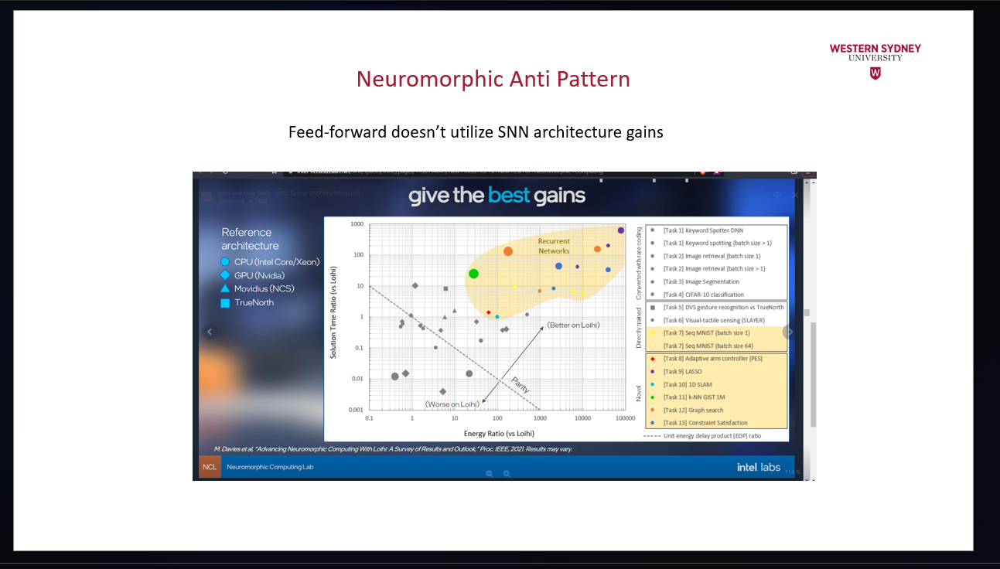
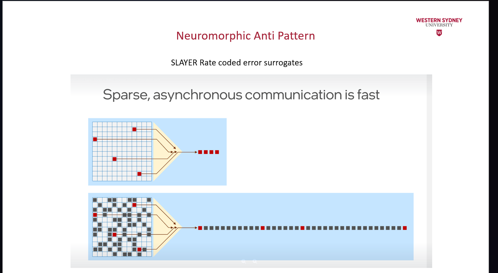
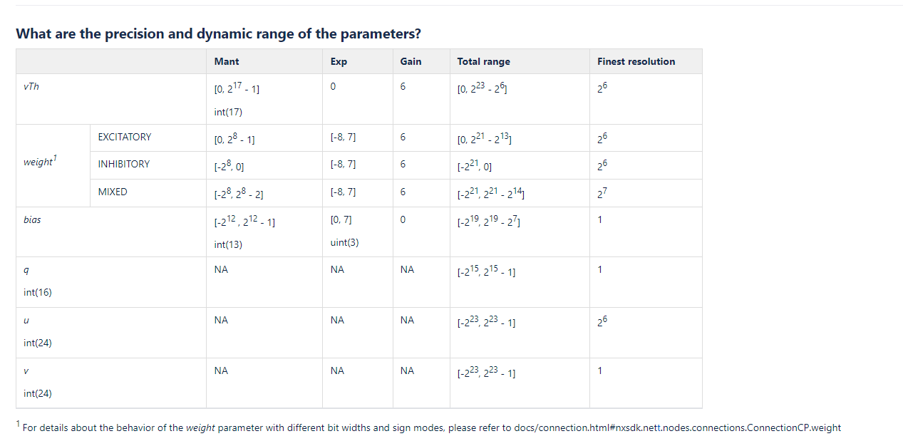

<h1 align="center">
   Lava and NXSDKs:
   Intel's long term vision of Neuromorphic computing.
</h1>

<h3 align="center">
    Russell Jarvis post-doctoral researcher at ICNS.
    r.jarvis@westernsydney.edu.au
</h3>

#### There are 3 Tutorial Options.

Loihi neurons are Current Based LIF models









### Take Home Assessment
Weight: $ 30% $
Type of Collaboration: Individual
Submission: Weeks 9 by Friday 11:59pm (midnight) Turnit in, and optionally an additional Overleaf link.
Format: The report will consist of 1000-1200 words and several figures. The purpose of this report is to demonstrate the completion of assigned preworks and labworks in programming Loihi. References, quotes, and appendices are not part of the word count.
Length: $1200$ words

### Structure of this guide, 
* briefly I will cover some important Loihi background
* then I will go into SHHing into Loihi via windows.


# At least **Five** major ways to program Loihi:
**NXSDK, NXNET, SNIPS (C code), Nengo-Loihi and Lava**.

* **Nengo-Loihi**

### Loihi Architecture Overview. 
Intel's Loihi research chip is an asynchronous, compute-in-memory neuromorphic processor optimized for the execution of Spiking Neural Networks. Loihi consists of 128 neurocores, each of which supports up to 1024 neurons

* Loihi is a fully digital architecture (some neuromorphic architectures are not).


Loihi neurons are Current Based LIF models


A recurrent neural network is a directed graph, it is also a function of Vertices and Edges:

 $ G(V, E) $


Deep learning networks are feedforward (although errors are backprogated), this is a different feedback signal.


**Note unitless. [−100,000,100,000]**

[-90,-50] $mV$ is a normal, range of neuron membrane potential in biologically grounded models like the standard LIF model. On Loihi this range has been re-normalised to be $ [-2^{23}, 2^{23}-1]  $


```
scp run_lava_dl.py ncl-edu.research.intel-research.net:~
```

Note ~ is home on the remote.
```
scp -r local_folder_name ncl-edu.research.intel-research.net:~/
```

Syncing with rsync¶
If you work on your local machine and push changes to multiple remote superhosts, it is worth spending some time to set up a robust solution for syncing files between your local machine and the superhosts.
The basic command that is most useful is
```
rsync -rtuv --exclude=*.pyc ncl-edu.research.intel-research.net ~/
```
-r recurses into subdirectories

-t copies and updates file modifications times

-u replaces files with the most up-to-date version as determined by modification time

-v adds more console output to see what has changed


# Only Neuron-Local Information
As discussed in "Simultaneous unsupervised and supervised learning of cognitive functions in biologically plausible spiking neural networks" by Bekolay et al., the effect of the PES learning rule on the decoders $ Δdi   $ is formulated as:

$ \Delta di=\Kappa Eai $

$E$ is the error vector is mapped onto individual neurons which also represent vectors of the same dimension. Biologically, the error vector is theorized to be dopamine levels.
ai is each neuron activity level, which in the NEF is defined as a combination of the neuron's encoder and it's activation function. See Principle 1 of the NEF for more detail.
κ is the error scaling factor


In fact the reason for the existence of Lava is to address fragmentation in the field.
<!--- --> 
I am just going to focus on Nengo, since its the only package that is stable and functional on the Loihi education server atm.


Loihi implaments a variant of the current-based synapse (CUBA) and leaky integrate and fire neuron model with two internal state variables:
* Synaptic  Current $ u_{i}(t) $ - the weighted sum of the input spikes and a constant bias. When you plot this, this is basically telling you how much or how many excitatory synaptic events the neuron is receiving.
* Membrane potential $v_{t}(t)$  a leaky (ie weakens over time) membrane voltage function, which sends a spike when the potential passes the firing threshold.
  * Unusual property of $v_{t}(t)$ it has highly non-biological plausible values $ [-100,000, 100,000] mV$ is normal.


Below is a diagram of the Potjan's cortical model. This model can be thought of as the composition of many weighted directed graphs, therefore we will use Lava a supported interface to begin to build a cortical model with the Python Loihi simulator.

### Insert a picture of a directed network graph from Loihi lecture Mark found.

### Setting up SSH Public Key Auth and SSH Proxies for the Neuromorphic Research Cloud Welcome to the Neuromorphic Research Cloud.

Setting up `SSH` Public Key Auth and `SSH` Proxies Please set up SSH jump host support and/or ssh public key auth. It is assumed that you are on a machine you control (you have some administrative privlige). Make two ssh keys, change the paths to match yours. Empty passphrases are fine. 

### Using OSX Terminal, Ubuntu Terminal, GitBash (for Windows) or Windows sub-system for Linux (WSL).

At your command prompt enter:
`username@yourowncomputer$ssh-keygen`   

Generating public/private rsa key pair. Enter file in which to save the key `(/home/username/.ssh/id_rsa)`: `/home/username/.ssh/vlab_gateway_rsa`   

Enter passphrase (empty for no passphrase): 
Enter same passphrase again: Your identification has been saved in `/home/username/.ssh/vlab_gateway_rsa`. 

Your public key has been saved in `/home/username/.ssh/vlab_gateway_rsa.pub`.   
The key fingerprint is: REDACTED The key's randomart image is:  REDACTED 
`username@yourowncomputer$ssh-keygen`  Generating public/private rsa key pair. Enter file in which to save the key (`/home/username/.ssh/id_rsa`): `/home/username/.ssh/vlab_ext_rsa` Enter passphrase (empty for no passphrase): Enter same passphrase again: Your identification has been saved in `/home/username/.ssh/vlab_ext_rsa`. Your public key has been saved in `/home/username/.ssh/vlab_ext_rsa.pub`.   The key fingerprint is: REDACTED The key's randomart image is: REDACTED Then you'll want to make your `~/.ssh/config` follow the pattern below.  


If on Windows, you can do all of this using Powershell and Notepad (which is POSIX compliant).

```
Host ssh.intel-research.netUser=username 
IdentityFile /home/username/.ssh/vlab_gateway_rsa 
Host *.research.intel-research.netHostName %h User=username
ProxyCommand= ssh -W %h:%p ssh.intel-research
netIdentityFile /home/username/.ssh/vlab_ext_rsa
``` 


For users connecting from Windows and using PowerShell or OpenSSH, the "`ProxyCommand ssh`" line needs a full path to the ssh command:   
`ProxyCommand= C:\Windows\System32\OpenSSH\ssh.exe -W %h:%p ssh.intel-research.net`

Next, send your public keys to `nrc_support@intel-research`.netand we will add them for you. Once Intel have notified that they have your keys,

export YOURORG="edu"

You should be able to ssh directly into: 
`ncl-edu.research.intel-research.net`

If you can't you can debug your config file with `-vv`.

```bash
ssh -vv ncl-edu.research.intel-research.net
```

Once you have sshd into the Intel cloud environment you can set the environment variables by editing your `~/.bashrc` file. If there is no .bashrc file in your home directory, please create one. In your `~/.bashrc` file, add this line: source `/nfs/ncl/.bashrc`

Note, there are variants of the shells available, here we use `.bashrc` as an example.    

## Important
Source your `~/.bashrc` file to load the changes with this command: source `~/.bashrc`. Now test to see that you did it correctly. Here's some typical output when running `sinfo command:username@THE_NRC_VM ~ % sinfo` 

For example: ``sinfo command:rjjarvis@ncl-edu ~ % sinfo`


### Next Confiigure your Loihi Cloud Experience

# Gotcha downgrade numpy

# Gotcha, upgrade pip


`cd ~ 
b.python3 -m venv python3_venv 
c.source python3_venv/bin/activate` 

4. Complete all following steps within the virtual environment 5.Copy Release artifacts: a.
5. `cp /nfs/ncl/releases/<latest_version>/* .`
6. .i. Note the “dot” at the end oft his command is necessary 7. Install NxSDK:
   a. `python -m pip install nxsdk-<latest_version>.tar.gz.` 
   
   Ignore the “Failedbuilding wheel for nxsdk” and the associated “Failed to build nxsdk.” This is a known error and pip will retry with setup.py.7.Unzip Tutorials, Docs, and Modules in your home directory:
   a. `mkdir nxsdk-apps && tar xzf nxsdk-apps-<latest_version>.tar.gz -C nxsdk-apps –stripcomponents 1`
   8. Refer to the 0.7 release notes for additional details, e.g. running tutorials
   a. `cd nxsdc-apps/docs`
   b.Refer to README.html scp README.html back to your machine.
   
   9. When complete, deactivate the virtual environ
   10. Remember to activate virtual environments every time you ssh back in and do development work with NXSDK.


# Gotcha's
The second latest version of nxsdk-2.0.0 needs a numpy downgrade.
Finally we need to do   
```pip install --upgrade numpy==1.20.1```
because most of the actual applications in apps, assume an older version of numpy that has a method `ascalar`, if we use a newer version of numpy, our applications will throw an `as_scalar` error.


you time out from ssh, when you log back in again, you fail to notice that you are no longer in the Python virtual enviroment.
```
rjjarvis@ncl-edu:~/nxsdk-apps-20220419-142407/n2_apps/tutorials/nxnet$ SLURM=1 python tutorial_23_noisy_winner_takes_all.py
  File "tutorial_23_noisy_winner_takes_all.py", line 4
SyntaxError: Non-ASCII character '\xc2' in file tutorial_23_noisy_winner_takes_all.py on line 4, but no encoding declared; see http://python.org/dev/peps/pep-0263/ for details
rjjarvis@ncl-edu:~/nxsdk-apps-20220419-142407/n2_apps/tutorials/nxnet$ history
   11  ls -ltr
```
The quickest practical solution is to type: `history`
and fish out the command where you activate the virtual environment.
One caveat make sure that you are in the $HOME directory when you do this.
```
  513  source python3_venv/bin/activate
```

```
alias intel="ssh rjjarvis@ncl-edu.research.intel-research.net"
PROMPT_COMMAND='history -a'
```

source /nfs/ncl/.bashrc
```
alias activ='cd ~; source python3_venv/bin/activate; cd ../'
alias tuts='cd /homes/rjjarvis/nxsdk-apps-20220419-142407/n2_apps/tutorials/nxnet'
```
Investigating the contribution of Scale to Loihi Speed


Gotcha accidentally installing the latest development version of Lava
```
git tag -n
```
```
(base) rjjarvis@rjjarvis:~/git/lava$ git tag -n
v0.1.0          Lava 0.1.0 (#4) ?
v0.1.1          Fix Packaging Bug (#30) ?
v0.2.0          Lava 0.2.0 (#117) ?
v0.3.0          Lava 0.3.0 (#201) ** use this version.
v0.4.0          Lava v0.4.0 (#265) * unstable
```

Conda and pip versions of lava may also be unstable.

2.4.2 Practical


Gotcha on Linux. 
Lava too many open files error.

Too many processes spawned by unittest (Potential memory leak) #71

To fix this run 

```
tutorials$ git checkout v0.3.0
ulimit -n 1048576
```


using the latest version tag.


 
