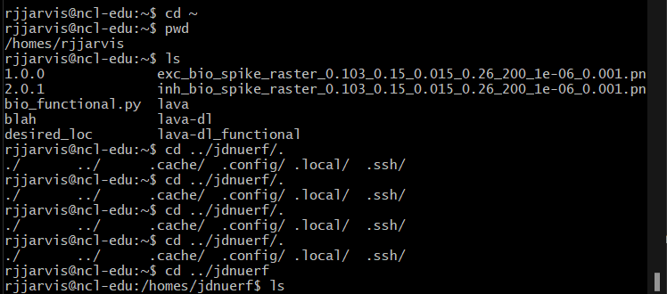

<h1 align="center">
      Guide for the Tutorial 
      Headless Linux for Hardware: Navigating the Intel Loihi Superhost 
</h1>

<h3 align="center">
    Russell Jarvis post-doctoral researcher at ICNS.
    r.jarvis@westernsydney.edu.au
</h3>

### Take Home Assessment
Weight: `30%` Type of Collaboration: Individual Submission: Weeks 9 by Friday 11:59pm (midnight) Turnit in, or optionally Markdown file or jupyter notebook on Github (just like this file, iself).

Format
The report will consist of 1000−1200 words and several figures. This report aims to demonstrate the completion of assigned pre works and labwork in programming Loihi. 

References, quotes, and appendices are not part of the word count. Length: 1200 words. You can include screenshots from todays Intel ssh experience, you can also paste BASH commands and Python code directly into markdown cells.

Note that today's tutorial is the easier of the two tutorials, but the technical skills taught today are the foundation for next Week's tutorial.

### Assessable parts of todays tutorial:

Most of the exercises are worth one mark if you describe them in the report next week. The work we cover today will add up to 15 available points marked on the final report. The final report totals 30 available marks, but it will span content from today's and next week's tutorials.

### You have configured ssh on your personal computer, congratulations on that!

A point to come back to, later in the tutorial I will teach you about BASH aliases that run on Loihi, you should set up an alias on your local machine so that you don't have to continuously re-type: 
```BASH
ssh ncl-edu.research.intel-research.net
alias intel="ssh ncl-edu.research.intel-research.net"
```

### Background

Many vendors provide access to POSIX-compliant terminals. For example, there is OSX Terminal, Ubuntu Terminal, GitBash (for Windows) or Windows sub-system for Linux (WSL), ```docker run -it```, the list goes on and on. Probably every primary operating system supports either BASH or some other POSIX-compliant shell (for example, Microsoft Powershell is finally now POSIX-compliant).

### For the first of two tutorials, we will:

* Use Secure Shell (ssh). I will often say "to ssh into", where I re-purpose the noun ssh as a verb in many contexts: For example, in today's tutorial we will ssh into the Intel super host and navigate the Linux environment.
* Configure and setup your Intel Superhost Linux environment by editing the files `~/.bash_profile` and `~/.bashrc`
* We will run a trivial lava program on hardware and simulation, and we will performance profile both versions of the program (in fact four different versions), making it possible to compare results. 
* Take screen shots, of files you have changed, or paste them into a markdown file.
* After today, You may commpare results in the first weeks section of the two week lab report.
* (Optional) scp the output of a lava simulation back to our local computer so we can comment on it.* `scp` the output of a lava simulation back to our local computer so we can comment on it.
* (Optional) Use secure copy (scp) and pip to install lava version tag 0.3.0 (the penultimate version).


### Background:

### Why Headless Linux?
On High-Performance Computers, Docker-containers, and resource-restricted hardware environments: Raspberri-PI, NVIDIA Jetson Nano etc. A "head-less" Linux login is often the default interface for accessing the resource. There are multiple reasons for this:

* A graphical Operating System (OS) acts as memory and CPU and load. On a Raspberry Pi, you will likely prefer to keep all the RAM and CPU for developing applications. Using a Raspberry Pi, the graphical OS will probably be unresponsive and clunky, as it is on the Nvidia Jetson Nano.
On a super-computer like the Intel Superhost, login nodes are shared between groups of 4 or more users. 

* Accessing a multiple user login computer via a Command Line Interface (CLI), scales very well and consumes minimal RAM compared to a graphical login. If and when someone runs an intensive computational job (a compute job), a schedular can adequately distribute the computational load onto any of the other non-login CPU nodes, or if no nodes are free, the scheduler can appropriate queue the job.

* Automation! Automation is my favourite reason for the Linux CLI. The CLI greatly enables the notion of the "power-user", a power-user is someone who has learned to elegantly solve problems using a handful of bash commands in minutes, where the commands substitute hours of mindnumbing mouse clicking and typing words into GUIs. 

Finally, Many of you may have heard of Dockerfiles. Dockerfiles are basically glorified Bourne Again Shell (BASH) scripts. Dockerfiles are useful for producing reproducible research, but also Docker containers empower the web, making up the majority of large-scale website deployments on Amazon Web Services (AWS).

### Exercise
After using:
```bash 
ssh ncl-edu.research.intel-research.net
```
to log into the Intel superhost, to see the activity of currently logged in users type `top`

### Background

### Why virtual environments?
Virtual environments allow you to set up multiple code projects with complicated dependencies so that each project's dependencies is contained in the scope of the virtual environment. The benefit of this cheap containerisation is it stops the creation of circular dependencies.

### Anatomy of the Linux prompt:

Linux (or BASH) commands can seem daunting to the uninitiated so let us find a long command and break it down into explainable parts.

In the longish Linux command below, everything to the left of $ is the path and everything to the left of @ is contextual.
```BASH
(python3_venv) rjjarvis@ncl-edu:~/nxsdk-apps-20220419-142407/n2_apps/tutorials/nxnet$ SLURM=1 python tutorial_18b_learning.py
```

I.e. the words inside the first braces `()` indicate that we are inside a virtual environment called `python3_venv`. Between the closing brace ) and `@` is `rjjarvis`, rjjarvis is the user's user name; in this case, it is my username.

the `~` symbol means the home directory. Tip: you can return to the home directory from anywhere with the simple command: `cd ~`. Another fancy way to do this is to do `cd $HOME`
`SLURM=1` is a command specific to the Intel super host that gives the user an interactively allocated CPU to play with here and now... Which leads to the question... "What is SLURM"?  

### What is SLURM and Why SLURM?

Slurm is scalable cluster management and job scheduling system for Linux clusters. As a cluster workload manager, SLURM allocates resources: Loihi boards, compute nodes and CPUs to users for some duration of time so they can perform work. Second, it provides a framework for starting, executing, and monitoring work (on other super-computers, a multicore multi-node job) on the set of allocated nodes. 
SLURM arbitrates contention for resources by managing a queue of pending work.

`python tutorial_18b_learning.py`, versus `SLURM=1 python tutorial_18b_learning.py` wont be felt by us. 

We use `SLURM=1` to preface our compute job as a courtesy to other users on the login node. If everyone uses `SLURM=1` as etiquette, the Linux experience will be a bit less laggy for everyone. Running quick jobs occasionally without SLURM will not be noticed, but if a person were not to use SLURM, the system admins would likely start to send you warning emails about this.

### Another Quick Comment.

The CLI can save you from re-typing long commands. If you type the command $history, the whole terminal screen will fill up with the most recent commands typed.

### Exercises:


### How to edit files on Headless Linux

To edit files on headless Linux, you can use any of the three editors: Nano, Vim, Emacs. Nano is often the beginner's preferred choice as it has no learning curve. There is always a cheat sheet displayed down the bottom of nano; knowledgable Linux users and power users often prefer VIM.

Once you have ssh'd into the Intel cloud superhost, you should edit your ~/.bash_profile file. By default, there is no pre-existing ~/.bash_profile file in your home directory, so please create one with `touch ~/.bash_profile`. Next you should then edit this empty file with `nano ~/.bash_profile`. In your `~/.bash_profile` file, add this line: `source /nfs/ncl/.bashrc`, as the 1st line, what this does is, it inherits an initialization script from an Intel template stored in the server root directory `/`, is the root directory. 

Source your `~/.bash_profile` file to load the changes with this command: `source ~/.bash_profile`; now test to see that you did it correctly. Here is some typical output when running `sinfo command:username@THE_NRC_VM ~ % sinfo`.

Create and populate a file ~/.bash_profile, then create a functional lava virtual environment and an alias for activating the virtual environment in ~/.bash_profile called actlav (activate Lava). 

At the end of today's tutorial, take a screenshot of the ~/.bash_profile, and save it so that you can paste it into the first half of the upcoming lab report.
Type source ~/.bash_profile every time you change this file and want the changes to take immediate effect.  Note logging in and out of ssh is also sufficient to "source" the file.

File `~/.bash_profile` contents:
```
source /nfs/ncl/.bashrc
# This is a BASH commment
# If you called your virtual environment lava_venv
# The alias below will activate the environment. 
alias activ='source ~/lava_venv/bin/activate' 
# to deactivate type the commmand`: deactivate
# create an alias, that automatically takes you to a long and hard to remember path:
alias tuts='cd /homes/rjjarvis/nxsdk-apps-20220419-142407/n2_apps/tutorials/nxnet'
```

Note the first line is:

```
source /nfs/ncl/.bashrc
```
As I discussed above.

### Upgrade pip
As soon you ssh into your Linux environment you will need to upgrade pip

```pip install --upgrade pip```


For Future Reference
At some point, it might be helpful to know that your Intel Loihi organisation is as follows: export YOURORG="edu", THE_NRC_VM: ncl-edu

For example: sinfo command:jdnuerf@ncl-edu ~ % sinfo ... or: sinfo command:drice@ncl-edu ~ % sinfo


### Background:

#### At least **Five** major ways to program Loihi:
#### **Lava**, and older methods: NXSDK, NXNET, SNIPS (C code), Nengo-Loihi.

One of the motivations for Lava's existence is because methods for programming Loihi were becoming too fragmented. In some respects, Lava is a unifying glue module analogous to Python and BASH as languages.

### Lava itself has several components: Lava-DL (Deep Learning), Lava-DNF (Dynamic Neural Fields) and Lava optimisation.

If there is time next Tuesday, we will look at Lava-DNF and Lava Optimisation.

### Loihi Architecture Overview. 
Intel's Loihi research chip is an asynchronous, compute-in-memory neuromorphic processor optimised for executing Spiking Neural Networks. 
I don't know about Loihi 2, but Loihi 1 consists of 128 neurocores, each supporting up to 1024 neurons. Loihi is a fully digital architecture (some neuromorphic architectures are analogue and mixed-signal).
A recurrent neural network is a directed graph, it is also a function of Vertices (neurons) and Edges (synapses): $ G(V, E) $

<!------>

### About Loihi Architecture.

Loihi 1 implements a variant of the current-based synapse (CUBA) and leaky integrate and fire neuron model with two internal state variables:
* Synaptic Current $ u_{i}(t) $ - the weighted sum of the input spikes and a constant bias. Plotting this tells you how much or how many excitatory synaptic events the neuron is receiving.
* Membrane potential vt(t) a leaky (ie weakens over time) membrane voltage function, which sends a spike when the potential passes the firing threshold.


# Loihi supports graded spike amplitudes, and that makes certain things possible.

Suppose you are programming in a manner where you record spike times but not raw neuron voltages. In that case, you may not notice that the simulated membrane potential of a current-based Loihi neuron is unitless and swings between $[−100,000,99,999]$**. Remember that $[-90,-50] mV$ is a normal range of neuron membrane potential in biologically grounded models like the standard LIF model. On Loihi this range has been re-normalised to be $ [-2^{23}, 2^{23
  *Unusual property of vt(t) it has highly non-biological plausible values $ [-100,000, 99,999] mV$ is normal.


### Exercises

Remember you can optionally deactivate the virtual environment at any point with the simple command `deactivate`.

Remember to activate virtual environments every time you ssh back in and do development work with Lava unless you have configured your ~/.bash_profile to do this for you automatically; the disadvantage to too much pre-emptive automation is that sometimes you might have multiple virtual environments.

### Launch Python from the command line:
simply typing `python` with no arguments will launch Python.
To apply Python to a script file type:
`python script_file_name.py`

### Except we are on the Intel superhost, so remember to do:
`SLURM=1 python script_file_name.py`

### Gotcha: No Longer in the virtual environment.
Overnight, you might choose to sleep instead of writing code. In sleep, you will time out from ssh; when you log back in again, you fail to notice that you are no longer in the Python virtual environment.

When starting a new day of code, you will find you are logged out of the Intel superhost (you can't stay signed-in in the absence of activity; eventually, your idle login will yield a: pipe-broken error). When your last ssh session has ended, it is common to forget that you may need to re-activate your virtual environment.

If you want to save time and effort, you might automatically activate the virtual environment using your: bash_profile script. Hint, you can borrow other people's code and scripts
```
pwd
cd ../
cd jdnuerf/
cd ../drice/
ls -ltr
```


You may already know that pressing the up and down cursor buttons will enable you to cycle through your bash history. If you typped a very long command, many commands ago, it is prefferable to type history, so you can read up to where it was when you typed the command.

Optionally to repeat a line of your CLI history, you can type `![the numeric value of a history line number]`. For example `!121` will issue the command from line 121 of your history. An even more powerful option is to hold the short cut `CTRL-R`. This will do a recursive search of your command line history.

```
history
   11  ls -ltr
```
The quickest practical solution is to type: `history`
and fish out the command where you activate the virtual environment.
One caveat make sure that you are in the $HOME directory when you do this.
```
  513  source python3_venv/bin/activate
```

```
alias intel="ssh rjjarvis@ncl-edu.research.intel-research.net"
PROMPT_COMMAND='history -a'
```

Exercises:
Execute the following BASH code and explain what it does in a few sentences (1 mark):
```
cd ~;
mkdir lava
cd lava
python3 -m venv lava_nx_env
source lava_nx_env/bin/activate
pip install --upgrade pip # already done above.
cp /nfs/ncl/lava/releases/v0.4.0/lava-nc-loihi-0.4.0.tar.gz ./.
pip install lava-nc-loihi-0.4.0.tar.gz
```
### Exercises Continued...
#### In BASH:
the `echo` command is analogous to `print` in Python, except it echo requires no braces for its arguments to print. `>>` means redirect. Redirection means instead of printing something to the screen, print the stdout to a file instead.

#### Exercises:
Continued from above execute the following BASH code and explain what it does in a few sentences (same 1 as above mark):
```
echo export SLURM=1  >> ~/.bashrc
echo export C_INCLUDE_PATH=\$C_INCLUDE_PATH:$(python3 -c "import nxcore; print(nxcore.__path__[0])")/include >> ~/.bashrc
echo export C_INCLUDE_PATH=\$C_INCLUDE_PATH:$(pwd)/lava-nc-loihi-0.4.0/tutorials/end_to_end >> ~/.bashrc
```


#### Be Careful With the Following: 
* **Don't** execute the following, but for one mark explain what it does.


```
echo export BOARD=ncl-ext-og-04  >> ~/.bashrc
echo export PARTITION=oheogulch  >> ~/.bashrc
```

```
cd lava-nc-loihi-0.4.0):
SLURM=1 LOIHI_GEN=N3B3 PARTITION=oheogulch RUN_LOIHI_TESTS=1 RUN_IT_TESTS=1 python -m unittest -v tests/lava/integration/<test_python_script>.py
```
```
(lava_nx_env) rjjarvis@ncl-edu:~$ SLURM=1 BOARD=ncl-ext-og-04 PARTITION=oheogulch python lava_test.py
```

Finally for 2 marks open VIM or Nano, instance those respective programs with a file name such as test lava: `vim lava_test.py`
`nano lava_test.py`

paste the following contents into the file:

```
    # Instantiate Lava processes to build network
    from lava.proc.dense.process import Dense
    from lava.proc.lif.process import LIF
    import numpy as np

    # declare a layer of Leaky Integrate and Fire Neurons of size 1.
    lif1 = LIF(shape=(1, ))
    # declare a layer of random valued weights of size 1.
    dense = Dense(weights=np.random.rand(1, 1))
    # declare a layer of Leaky Integrate and Fire Neurons of size 1.
    lif2 = LIF(shape=(1, ))

    # Connect processes via their directional input and output ports
    lif1.out_ports.s_out.connect(dense.in_ports.s_in)
    dense.out_ports.a_out.connect(lif2.in_ports.a_in)

    # Execute process lif1 and all processes connected to it for fixed number of steps
    from lava.magma.core.run_conditions import RunSteps
    from lava.magma.core.run_configs import Loihi2HwCfg

    lif1.run(condition=RunSteps(num_steps=10), run_cfg=Loihi2HwCfg())
    lif1.stop()
```

Now apply Python to this script with:
`SLURM=1 python lava_test.py`


For the rest of the marks do the following:

We want to profile the run time of the whole script. 

Paste the following code statements at select locations in the code

```
import cProfile
def main():
        """
        wrap the whole code chunk in the function definition main.
        """
        return None
if __name__ == '__main__':
    cProfile.run('main()')
```

Now make a copy of the file:
`cp lava_test.py bigger_lava_test.py`

Now we want to make the network bigger, and we want to explore how making the network bigger slows down CPU performance.

Figure out which three lines of code you would need to change to increase the number of neurons per layer by an order of 1000 then run the profiled code.
`SLURM=1 python bigger_lava_test.py`

Finally copy this new profiled code into a file: simulated_lava_test
`cp bigger_lava_test.py simulated_lava_test.py`

Place the line:
```
from lava.magma.core.run_configs import Loihi1SimCfg
sim_run_cfg = Loihi1SimCfg()
```
before the line 
```
lif1.run(condition=RunSteps(num_steps=10), run_cfg=Loihi2HwCfg())
```
Now edit the above line so that it the Loihi hardware executor uses a simulated backend instead of the real Loihi hardware.

create a bash alias to run your file: 
```~/.bash_profile```

```alias runl='SLURM=1 BOARD=ncl-ext-og-04 PARTITION=oheogulch python simulated_lava_test.py'```

You can also pipe the result to `less` using:

```SLURM=1 BOARD=ncl-ext-og-04 PARTITION=oheogulch python simulated_lava_test.py | less```
. Note that BASH's pipe operator is the true meaning and origin of pipelines in data science.

exit your ssh session by typing exit. Log back in again and confirm that the alias works.

### Submit as part of the final written report In the lab report answer the following questions, due in 2 weeks.

When running the simulated Loihi, is a the network faster or slower for a simulated network of 100 layer 1 by 100 neurons layer 2 (all to all connectivity), versus 1 by 1 neuron (all to all connectivity). Was the speed difference as significant as you would have thought?

Using the `Loihi2HwCfg()` hardware executor, compare the same job run on both machines, using network sizes 1by1, and 100 by 100 in hardware. Compare the speeds of these two sizes of network simulation on hardware.
Is using the hardware faster or slower than the simulator? 

In your answer, include a discussion about software to-hardware communication. Also, note that the type of job we gave the hardware did not involve causing the network to create or transmit spikes within or between neurocores on Loihi. Given that there was no spikes production or transmission, what extra steps might we include to make the hardware simulation faster than the software simulation?

Submit as part of the final written report. In the lab report, answer the following questions, due in 2 weeks.
When running the simulated Loihi, is a the network faster or slower for a simulated network of 100 layer 1 by 100 neurons layer 2 (all to all connectivity), versus 1 by 1 neuron (all to all connectivity). Was the speed difference as significant as you would have thought?
Using the Loihi2HwCfg() hardware executor, compare the same job run on both machines, using network sizes 1by1, and 100 by 100 in hardware. Compare the speeds of these two sizes of network simulation on hardware.
Is using the hardware faster or slower than the simulator? 

In your answer, include a discussion about software to-hardware communication. Also, note that the type of job we gave the hardware did not involve causing the network to create or transmit spikes within or between neurocores on Loihi. Given that there was no spikes production or transmission, what extra steps might we include to make the hardware simulation faster than the software simulation?
Preview and or Bonus Points:

On your local machine, run:
```
git clone lava-nc/lava: A Software Framework for Neuromorphic Computing (github.com)
cd lava
cd tutorials/in_depth
jupyter notebooks tutorial06_hierarchical_processes.ipynb
```
Inside Jupyter notebook is a tool to convert notebooks to plain python code. Convert the notebook to a file called tutorial06_hierarchical_processes.py 
Using any convenient method change this file name from tutorial06_hierarchical_processes.py  to lava_spk_test.py

Use scp to cp this file to your Intel super host home:
```
scp lava_spk_test.py ncl-edu.research.intel-research.net:~/
```
Run the file on Loihi with:
```
SLURM=1 BOARD=ncl-ext-og-04 PARTITION=oheogulch python lava_spk_test.py
```
It will partially run and fail. Save the error messages and write a bug report to INRC forums.
Next week we will look at installing Lava v-0.3.0 from the source code.
We will look at running less trivial examples; this may include installing Lava from source code on your local machine or the Intel Superhost as appropriate.

### Preview only  (not assessable)
```
on your local machine:
First, create a virtual environment.
cd ~ 
python3 -m venv lava_from_src
source lava_from_src/bin/activate
git tag -n # to list the second latest tag 0.3.0
git checkout # enter tag number from above.
```
Then git checkout the release corresponding to tag 0.3.0 using the command git checkout
git clone will not work there, but git generally works. We can scp the github version of Lava onto the Loihi superhost.
Next week will Look into using scp or rsync too:
Note scp is like cp and ssh combined into the same statement.
```
scp run_lava_dl.py ncl-edu.research.intel-research.net:~
```
Note ~ is home in any bash environment.
```
scp -r local_folder_name ncl-edu.research.intel-research.net:~/
```

## Preview:

### Next week we will look at installing Lava from source code.
We will look at running less trivial examples, this may include installing lava from source code on your local machine, or the Intel Superhost as appropriate. 

First create a virtual environment.

```
cd ~ 
python3 -m venv lava_from_src
source lava_from_src/bin/activate
git tag -n # to list the second latest tag 0.3.0
git checkout # enter tag number from above.
```
Then git checkout the release corresponding to tag 0.3.0 using the command git checkout


git clone will not work there but git generally works. We can scp the github version of lava onto the Loihi superhost.


#### Next Week will Look into using scp or rsync too:

Note `scp` is like `cp` and `ssh` combined into the same statement.

```
scp run_lava_dl.py ncl-edu.research.intel-research.net:~
```

Note `~` is home in any bash environment.
```
scp -r local_folder_name ncl-edu.research.intel-research.net:~/
```
