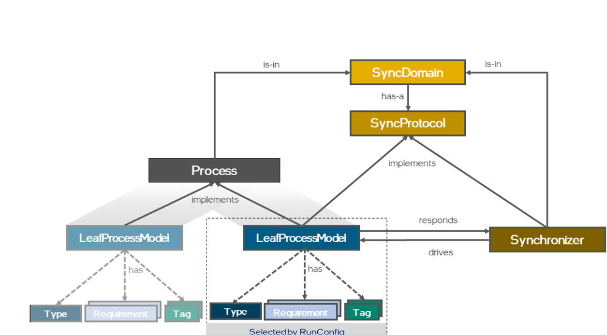
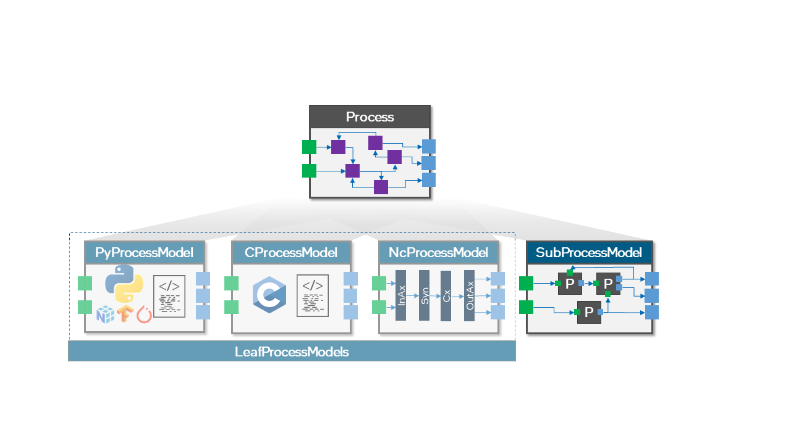

<h1 align="center">
      Guide for the Tutorial 
      Headless Linux for Hardware: Navigating the Intel Loihi Superhost 
</h1>

<h3 align="center">
    Russell Jarvis post-doctoral researcher at ICNS.
    r.jarvis@westernsydney.edu.au
</h3>

### Take Home Assessment
Weight: `30%` Type of Collaboration: Individual Submission: Weeks 9 by Friday 11:59pm (midnight) Turnit in, or optionally Markdown file or jupyter notebook on Github (just like this file, iself).

Format
The report will consist of 1000−1200 words and several figures. This report aims to demonstrate the completion of assigned pre works and labwork in programming Loihi. 

References, quotes, and appendices are not part of the word count. Length: 1200 words. You can include screenshots from todays Intel ssh experience, you can also paste BASH commands and Python code directly into markdown cells.

Note that today's tutorial is the harder of the two tutorials, but the technical skills taught today are the foundation for next Week's tutorial.

<summary>

### Interesting parts of todays tutorial:

</summary>

<details>
  * compute the inter-spike intervals of spike times.
    * If spike times are in an array, you want get the delta between spk_times[1]-spk_times[0], and spk_times[2]- spk_times[1], ..., spk_times[N]- spk_times[N-1].
      * Each of these deltas constructed from pairs will be the element of an array called ISI.
  * Compute the coefficient of variation of Interspike intervals of spike trains. var(ISI)/mean(ISI). This a measure of dispersal, ie spike interval irregularity.
  * get the mean CV of a population of cells.
  * Regular asynchronous spiking.
* How to kill your zombie processes:
  * SLURM `scancel`.
  * Linux everywhere else: `top`, and `kill`.
  * Navigate to each others directory and execute each others code.

I will provide boiler plate code and established packages that calculate spike time co-efficient of variation $CV$ and spike train distance.

re-apply this template code on Loihi network simulator activity to regular periodic firing and irregular firing network activity. 

For low and high variability of spike times, comment on the ability of neurons to encode information if each unique interspike interval represents a unique feature or property.

</details>


### Reservoir Computing and Echo State balanced E/I networks.

Take the spike trains corresponding to cells 18 and 23 [](https://github.com/russelljjarvis/lava/blob/main/tutorials/end_to_end/tutorial02_excitatory_inhibitory_network.ipynb
) of the notebook. Flesch out the skeleton methods provided on [](https://github.com/russelljjarvis/lava/blob/main/app.py#L622-L636) to compute the Interspike Interval arrays and the Coefficient of Variation of the spike trains.

The $ ISI_{CV} $ is actually less useful than the auto-covariance measures calculated in the network, but the CV is very simple to implement and understand.


Task for two pre-existing Unit test files in the lava-loihi tests directory, run the two files to completion
Comment out any method decorators that look like they would 
.


```BASH
cd $HOME

scp ncl-edu.research.intel-research.net:/nfs/ncl/lava/releases/v0.4.0/lava-nc-loihi-0.4.0.tar.gz .
tar -xf lava-nc-loihi-0.4.0.tar.gz
cd lava-nc-loihi-0.4.0
cd tests/lava/integration
code test_integration_uc_lif_dense_lif.py

```

Decorator requires LMT (Lakemount CPU)
```python
@implements(proc=Injector, protocol=LoihiProtocol)
@requires(LMT)
```
nc means neuro-core.

```python
        weights = (np.arange(in_size * out_size).reshape(out_size, in_size) + 1)
        bias = 10 * np.ones(in_size, dtype=np.int32)

        input_lif = LIF(shape=(in_size,),
                        du=0,
                        dv=0,
                        bias_mant=bias,
                        bias_exp=6,
                        vth=20)
        output_lif = LIF(shape=(out_size,),
                         du=4096,
                         dv=4096,
                         vth=1024)
        dense = Dense(weights=weights)

        input_lif.s_out.connect(dense.s_in)
        dense.a_out.connect(output_lif.a_in)

        nc_domain = SyncDomain("nc", LoihiProtocol(), [input_lif, dense,
                                                       output_lif])
 ```

```python
py_process = RingBuffer(**py_params)
spikes_computed = py_process.data.get()
```

Comment out any decorators that look like this:

`@unittest.skip`
`RUN_IT_TESTS=1`
unless it says: `@skipUnless(run_it_tests, "")` as we launch Python with the argument `RUN_IT_TESTS=1`, this argument is visible to the Unit test function decorator.

#@unittest.skipUnless(run_it_tests, "") 

# activate the lava virtual environment using the alias you defined in lab1.
``` BASH
cd lava-nc-loihi-0.4.0
SLURM=1 LOIHI_GEN=N3B3 PARTITION=oheogulch RUN_LOIHI_TESTS=1 RUN_IT_TESTS=1 python -m unittest -v tests/lava/integration/test_integration_multi_layer_lif_dense_with_io.py
```

lava-nc-loihi-0.4.0/tests/lava/integration/test_integration_multi_layer_lif_dense_with_io.py


source lava_nx_env/bin/activate
```
SLURM=1 LOIHI_GEN=N3B3 PARTITION=oheogulch RUN_LOIHI_TESTS=1 RUN_IT_TESTS=1 python -m unittest -v tests/lava/integration/test_integration_multi_layer_lif_dense_with_io.py
```

Most of the exercises are worth one mark if you describe them in the report next week. The work we cover today will add up to 15 available points marked on the final report. The final report totals 30 available marks, but it will span content from today's and next week's tutorials.

Using last weeks alias:
```BASH
intel
```

### Background

#### The Lava task-graph.

In Lava design all of the different processes that make up a Network simulation, all of the processes are constructed togethor into a compute job task-graph. This is a bit similar to other parallel computing paradigms like Python Dask.

Calling run on a leaf-node (or root node) is sufficient to run the network comprised by the whole task-graph.




# Dense is the container type used to create weighted synaptic connections.

```python
in_size = 1
out_size = 1500
# weights are all 1
weights = np.ones((out_size, in_size)) * 2
bias = 10 * np.ones(in_size, dtype=np.int32)

input_lif = LIF(shape=(in_size,),
                du=0,
                dv=0,
                bias_mant=bias,
                bias_exp=6,
                vth=20)
output_lif = LIF(shape=(out_size,),
                  du=4096,
                  dv=4096,
                  vth=1536)
# We can create a very simple set of neural pathways, by taking a uniform weight matrix. The input matrix is `1` by `1500`
```
```weights = np.ones((out_size, in_size)) * 2```

Multiple Choice question, what is the connection type:

(a) all-to-all,
(b) many-to-one
(c) one-to-many


a list of input cells `input_lif` and a list of output cells: `output_lif`, and connecting them together with the Dense container. Basically the dense container, upgrades the type of a numpy matrix. 

dense = Dense(weights=weights)
input_lif.s_out.connect(dense.s_in)
dense.a_out.connect(output_lif.a_in)
for j in range(4): input_lif.run(condition=run_cnd, run_cfg=run_cfg)
 

### Background:


### More about SLURM

```
top
```

```
scancel
```


### More aliases to speed up Linux CLI Experience.

An alias for history 
alias h='history'
An alias to edit ~/.bash_profile in nano:
alias bpn='nano ~/.bash_profile'


### Exercises:


### Background:

#### As I wrote, **Lava**, and older methods: NXSDK, NXNET, SNIPS (C code), Nengo-Loihi.

As of Sunday Lava now supports STDP and balanced biological networks, however, whether any one can install and run them is a different question.


### Lava itself has several components: Lava-DL (Deep Learning), Lava-DNF (Dynamic Neural Fields) and Lava optimisation.

Let us take a look at DNF.


<!---->


<!----->


### Loihi Architecture Overview. 


# Loihi supports graded spike amplitudes, and that makes certain things possible.
As I said in the previous tutorial, Loihi spikes are large and graded.


Ports are abstractions around processes. If a process has an in-port and an out-port it can be communicated with.


Suppose you are programming in a manner where you record spike times but not raw neuron voltages. In that case, you may not notice that the simulated membrane potential of a current-based Loihi neuron is unitless and swings between $[−100,000,99,999]$**. Remember that $[-90,-50] mV$ is a normal range of neuron membrane potential in biologically grounded models like the standard LIF model. On Loihi this range has been re-normalised to be $ [-2^{23}, 2^{23
  *Unusual property of vt(t) it has highly non-biological plausible values $ [-100,000, 99,999] mV$ is normal.


### Exercises

Remember you can optionally deactivate the virtual environment at any point with the simple command `deactivate`.

Remember to activate virtual environments every time you ssh back in and do development work with Lava unless you have configured your ~/.bash_profile to do this for you automatically; the disadvantage to too much pre-emptive automation is that sometimes you might have multiple virtual environments.


If you want to save time and effort, you might automatically activate the virtual environment using your: bash_profile script. Hint, you can borrow other people's code and scripts
```
pwd
cd ../
cd jdnuerf/
cd ../drice/
ls -ltr
```


```

cp /nfs/ncl/lava/releases/v0.4.0/lava-nc-loihi-0.4.0.tar.gz .
tar -xzv lava-nc-loihi-0.4.0.tar.gz
```
### Exercises Continued...
#### In BASH:

#### Exercises:

Streamlit application

Use your GitHub account to invite yourself to streamlit:

Streamlit-share is able to build applications from git repositories

#### Talk through Basic Python Code:


```
    # Instantiate Lava processes to build network
    from lava.proc.dense.process import Dense
    from lava.proc.lif.process import LIF
    import numpy as np
    # Execute process lif1 and all processes connected to it for fixed number of steps
    from lava.magma.core.run_conditions import RunSteps
    from lava.magma.core.run_configs import Loihi2HwCfg

    # declare a layer of Leaky Integrate and Fire Neurons of size 1.
    lif1 = LIF(shape=(1, ))
    # declare a layer of random valued weights of size 1.
    dense = Dense(weights=np.random.rand(1, 1))
    # declare a layer of Leaky Integrate and Fire Neurons of size 1.
    lif2 = LIF(shape=(1, ))
    ```

What is a Process?
This tutorial will show how to create a Process that simulates a group of leaky integrate-and-fire neurons. But in Lava, the concept of Processes applies widely beyond this example. In general, a Process describes an individual program unit which encapsulates

data that store its state,
algorithms that describe how to manipulate the data,
ports that share data with other Processes, and
an API that facilitates user interaction.
A Process can thus be as simple as a single neuron or a synapse, as complex as a full neural network, and as non-neuromorphic as a streaming interface for a peripheral device or an executed instance of regular program code.


AbstractProcess: Defining Vars, Ports, and the API
When you create your own new process, you need to inherit from the AbstractProcess class. As an example, we will implement the class LIF, a group of leaky integrate-and-fire (LIF) neurons.


Create LIF and Dense Processes and ProcessModels
The ProcessModel Tutorial walks through the creation of a LIF Process and an implementing PyLoihiProcessModel. Our DenseLayer Process additionally requires a Dense Lava Process and ProcessModel that have the behavior of a dense set of synaptic connections and weights. The Dense Connection Process can be used to connect neural Processes. For completeness, we'll first briefly show an example LIF and Dense Process and PyLoihiProcessModel.

# The port, a port is an abstraction layer around a Lava Process, that enables it to interact with the outside world.

    # Connect processes via their directional input and output ports
    lif1.out_ports.s_out.connect(dense.in_ports.s_in)
    dense.out_ports.a_out.connect(lif2.in_ports.a_in)

    ``` 
    lif1.run(condition=RunSteps(num_steps=10), run_cfg=Loihi2HwCfg())
    lif1.stop()
```

Now apply Python to this script with:
`SLURM=1 python lava_test.py`


Now we want to make the network bigger, and we want to explore how making the network bigger slows down CPU performance.

Figure out which three lines of code you would need to change to increase the number of neurons per layer by an order of 1000 then run the profiled code.
`SLURM=1 python bigger_lava_test.py`

Finally copy this new profiled code into a file: simulated_lava_test
`cp bigger_lava_test.py simulated_lava_test.py`

Place the line:
```
from lava.magma.core.run_configs import Loihi1SimCfg
sim_run_cfg = Loihi1SimCfg()
```
before the line 
```
lif1.run(condition=RunSteps(num_steps=10), run_cfg=Loihi2HwCfg())
```
Now edit the above line so that it the Loihi hardware executor uses a simulated backend instead of the real Loihi hardware.

create a bash alias to run your file: 
```~/.bash_profile```

```alias runl='SLURM=1 BOARD=ncl-ext-og-04 PARTITION=oheogulch python simulated_lava_test.py'```

You can also pipe the result to `less` using:

```SLURM=1 BOARD=ncl-ext-og-04 PARTITION=oheogulch python simulated_lava_test.py | less```
. Note that BASH's pipe operator is the true meaning and origin of pipelines in data science.

exit your ssh session by typing exit. Log back in again and confirm that the alias works.

### Submit as part of the final written report In the lab report answer the following questions, due in 2 weeks.

When running the simulated Loihi, is a the network faster or slower for a simulated network of 100 layer 1 by 100 neurons layer 2 (all to all connectivity), versus 1 by 1 neuron (all to all connectivity). Was the speed difference as significant as you would have thought?

Using the `Loihi2HwCfg()` hardware executor, compare the same job run on both machines, using network sizes 1by1, and 100 by 100 in hardware. Compare the speeds of these two sizes of network simulation on hardware.
Is using the hardware faster or slower than the simulator? 

In your answer, include a discussion about software to-hardware communication. Also, note that the type of job we gave the hardware did not involve causing the network to create or transmit spikes within or between neurocores on Loihi. Given that there was no spikes production or transmission, what extra steps might we include to make the hardware simulation faster than the software simulation?

Submit as part of the final written report. In the lab report, answer the following questions, due in 2 weeks.
When running the simulated Loihi, is a the network faster or slower for a simulated network of 100 layer 1 by 100 neurons layer 2 (all to all connectivity), versus 1 by 1 neuron (all to all connectivity). Was the speed difference as significant as you would have thought?
Using the Loihi2HwCfg() hardware executor, compare the same job run on both machines, using network sizes 1by1, and 100 by 100 in hardware. Compare the speeds of these two sizes of network simulation on hardware.
Is using the hardware faster or slower than the simulator? 

In your answer, include a discussion about software to-hardware communication. Also, note that the type of job we gave the hardware did not involve causing the network to create or transmit spikes within or between neurocores on Loihi. Given that there was no spikes production or transmission, what extra steps might we include to make the hardware simulation faster than the software simulation?
Preview and or Bonus Points:

On your local machine, run:
```
git clone lava-nc/lava: A Software Framework for Neuromorphic Computing (github.com)
cd lava
cd tutorials/in_depth
jupyter notebooks tutorial06_hierarchical_processes.ipynb
```
Inside Jupyter notebook is a tool to convert notebooks to plain python code. Convert the notebook to a file called tutorial06_hierarchical_processes.py 
Using any convenient method change this file name from tutorial06_hierarchical_processes.py  to lava_spk_test.py

Use scp to cp this file to your Intel super host home:
```
scp lava_spk_test.py ncl-edu.research.intel-research.net:~/
```
Run the file on Loihi with:
```
SLURM=1 BOARD=ncl-ext-og-04 PARTITION=oheogulch python lava_spk_test.py
```
It will partially run and fail. Save the error messages and write a bug report to INRC forums.
Next week we will look at installing Lava v-0.3.0 from the source code.
We will look at running less trivial examples; this may include installing Lava from source code on your local machine or the Intel Superhost as appropriate.

### Preview only  (not assessable)
```
on your local machine:
First, create a virtual environment.
cd ~ 
python3 -m venv lava_from_src
source lava_from_src/bin/activate
git tag -n # to list the second latest tag 0.3.0
git checkout # enter tag number from above.
```
Then git checkout the release corresponding to tag 0.3.0 using the command git checkout
git clone will not work there, but git generally works. We can scp the github version of Lava onto the Loihi superhost.
Next week will Look into using scp or rsync too:
Note scp is like cp and ssh combined into the same statement.
```
scp run_lava_dl.py ncl-edu.research.intel-research.net:~
```
Note ~ is home in any bash environment.
```
scp -r local_folder_name ncl-edu.research.intel-research.net:~/
```

## Preview:

### Next week we will look at installing Lava from source code.
We will look at running less trivial examples, this may include installing lava from source code on your local machine, or the Intel Superhost as appropriate. 

First create a virtual environment.

```
cd ~ 
python3 -m venv lava_from_src
source lava_from_src/bin/activate
git tag -n # to list the second latest tag 0.3.0
git checkout # enter tag number from above.
```
Then git checkout the release corresponding to tag 0.3.0 using the command git checkout


git clone will not work there but git generally works. We can scp the github version of lava onto the Loihi superhost.


#### Next Week will Look into using scp or rsync too:

Note `scp` is like `cp` and `ssh` combined into the same statement.

```
scp run_lava_dl.py ncl-edu.research.intel-research.net:~
```

Note `~` is home in any bash environment.
```
scp -r local_folder_name ncl-edu.research.intel-research.net:~/
```
