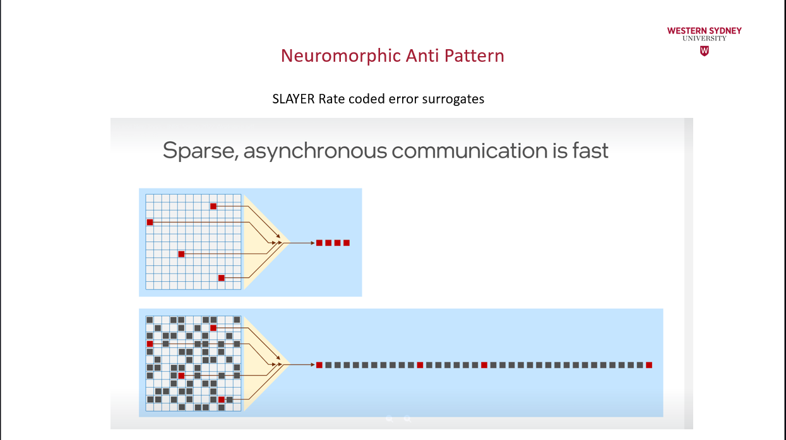
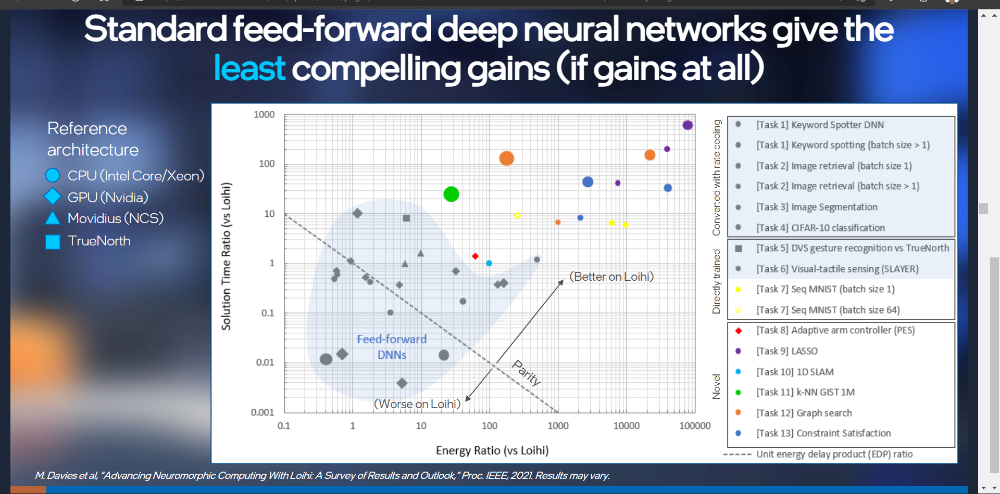
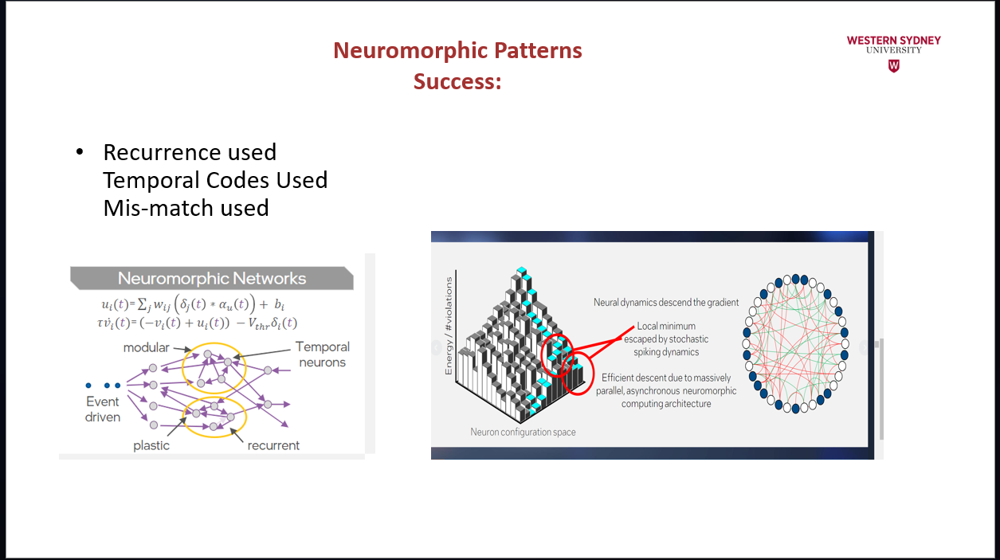
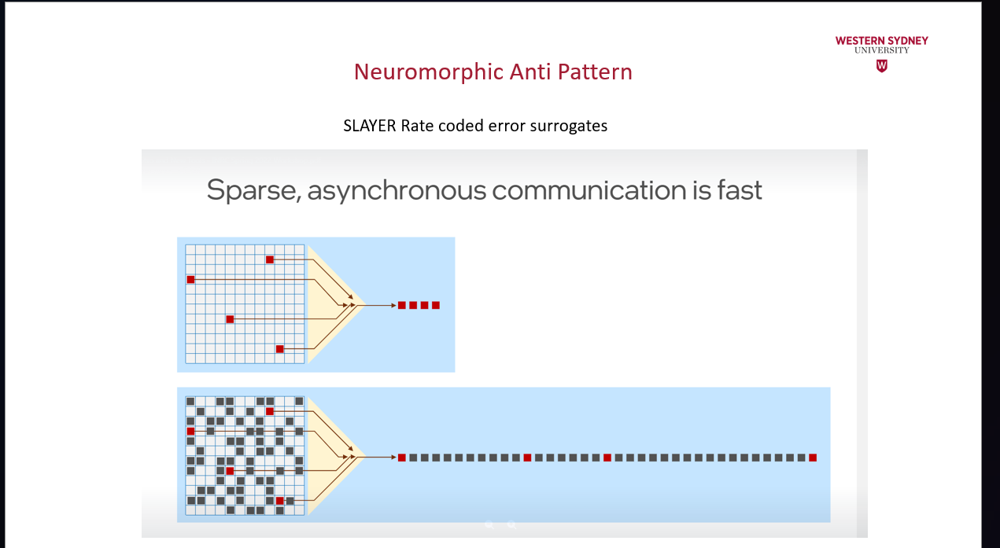
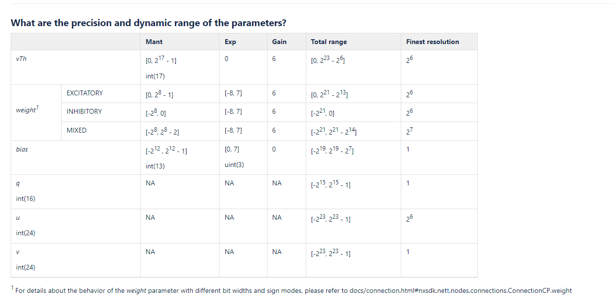
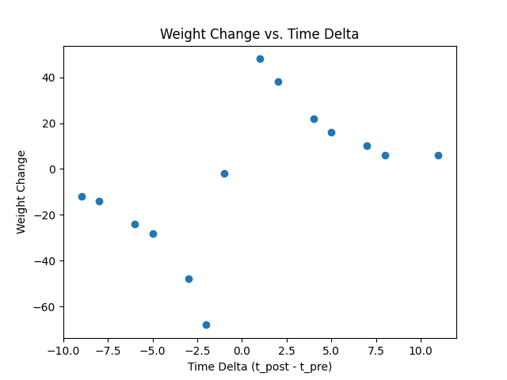
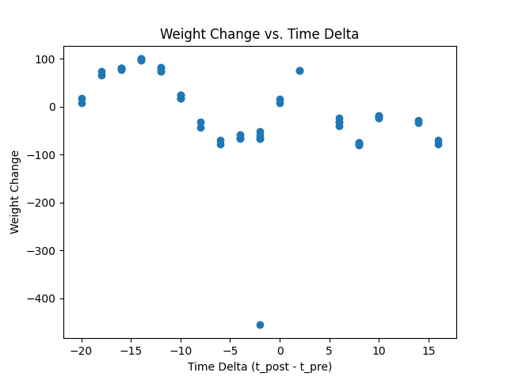
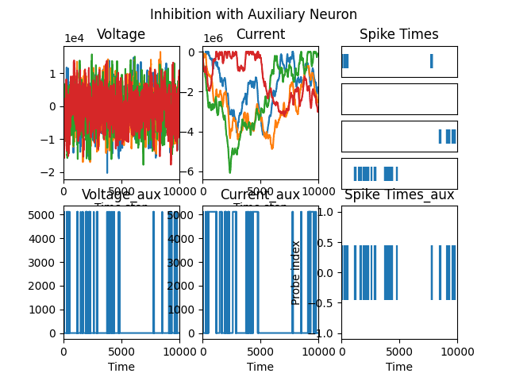
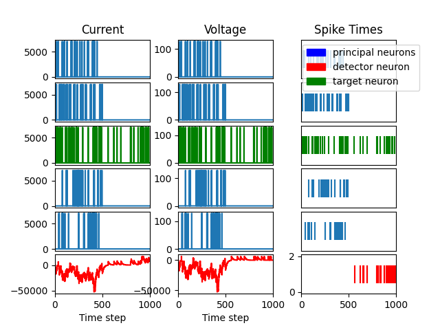
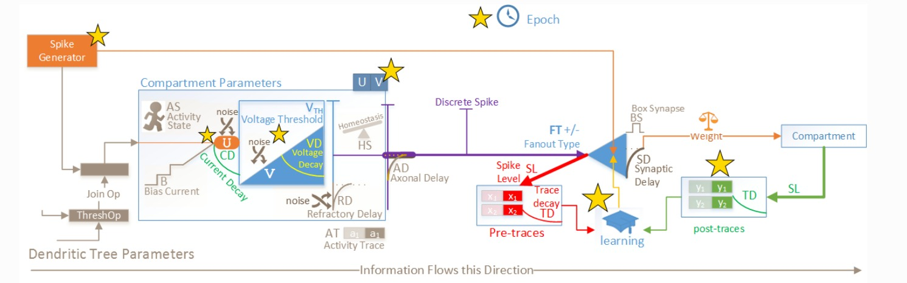

Loihi neurons are Current Based LIF models


















* Initially I planned to structure this tutorial as follows.
1. Evaluate the speed of Loihi, using Nengo Loihi, CPU Nengo and Lava. 

2. Install older lava.

   1. Biological Network (nengo-loihi).
 
On:
    x. Login to INRC confluence/Atlassian page
    x. Show that you can do system-admin on Intel Superhost.

    Dont do anymore
    1. PES (nengo-loihi).
    3. Trivial example Lava code but scale it up and test Loihi energy consumption, and Lava CPU backend.
    4. Impress upon students that Lava will be good some day.


#### I cannot garuntee that you will be able to run jobs on hardware.
#### There are 3 Tutorial Options.

* On the Intel superhostand you are often better off for discussing what you are doing in a forum: so that people are aware of your work, if your work is invisible people may not care it.


### Structure of this guide, 
* Briefly I will cover some important Linux and Loihi background
* Then I will go into SHHing into Linux on Loihi via windows.





Deep learning networks are feedforward (although errors are backprogated), this is a different feedback signal.


Syncing with rsync¶
If you work on your local machine and push changes to multiple remote superhosts, it is worth spending some time to set up a robust solution for syncing files between your local machine and the superhosts.
The basic command that is most useful is
```
rsync -rtuv --exclude=*.pyc ncl-edu.research.intel-research.net ~/
```
-r recurses into subdirectories

-t copies and updates file modifications times

-u replaces files with the most up-to-date version as determined by modification time

-v adds more console output to see what has changed


# Only Neuron-Local Information
As discussed in "Simultaneous unsupervised and supervised learning of cognitive functions in biologically plausible spiking neural networks" by Bekolay et al., the effect of the PES learning rule on the decoders $ Δdi   $ is formulated as:

$ \Delta di=\Kappa Eai $

$E$ is the error vector is mapped onto individual neurons which also represent vectors of the same dimension. Biologically, the error vector is theorized to be dopamine levels.
ai is each neuron activity level, which in the NEF is defined as a combination of the neuron's encoder and it's activation function. See Principle 1 of the NEF for more detail.
κ is the error scaling factor


### Setting up SSH Public Key Auth and SSH Proxies for the Neuromorphic Research Cloud Welcome to the Neuromorphic Research Cloud.

Setting up `SSH` Public Key Auth and `SSH` Proxies Please set up SSH jump host support and/or ssh public key auth. It is assumed that you are on a machine you control (you have some administrative privlige). Make two ssh keys, change the paths to match yours. Empty passphrases are fine. 


At your command prompt enter:
`username@yourowncomputer$ssh-keygen`   

Generating public/private rsa key pair. Enter file in which to save the key `(/home/username/.ssh/id_rsa)`: `/home/username/.ssh/vlab_gateway_rsa`   

Enter passphrase (empty for no passphrase): 
Enter same passphrase again: Your identification has been saved in `/home/username/.ssh/vlab_gateway_rsa`. 

Your public key has been saved in `/home/username/.ssh/vlab_gateway_rsa.pub`.   
The key fingerprint is: REDACTED The key's randomart image is:  REDACTED 
`username@yourowncomputer$ssh-keygen`  Generating public/private rsa key pair. Enter file in which to save the key (`/home/username/.ssh/id_rsa`): `/home/username/.ssh/vlab_ext_rsa` Enter passphrase (empty for no passphrase): Enter same passphrase again: Your identification has been saved in `/home/username/.ssh/vlab_ext_rsa`. Your public key has been saved in `/home/username/.ssh/vlab_ext_rsa.pub`.   The key fingerprint is: REDACTED The key's randomart image is: REDACTED Then you'll want to make your `~/.ssh/config` follow the pattern below.  


If on Windows, you can do all of this using Powershell and Notepad (which is POSIX compliant).

```
Host ssh.intel-research.netUser=username 
IdentityFile /home/username/.ssh/vlab_gateway_rsa 
Host *.research.intel-research.netHostName %h User=username
ProxyCommand= ssh -W %h:%p ssh.intel-research
netIdentityFile /home/username/.ssh/vlab_ext_rsa
``` 


For users connecting from Windows and using PowerShell or OpenSSH, the "`ProxyCommand ssh`" line needs a full path to the ssh command:   
`ProxyCommand= C:\Windows\System32\OpenSSH\ssh.exe -W %h:%p ssh.intel-research.net`

Next, send your public keys to `nrc_support@intel-research.net` and we will add them for you. Once Intel have notified that they have your keys,

export YOURORG="edu"

You should be able to ssh directly into: 
`ncl-edu.research.intel-research.net`

If you can't you can debug your config file with `-vv`.

# Gotcha downgrade numpy
4. Complete all following steps within the virtual environment 5.Copy Release artifacts: a.
5. `cp /nfs/ncl/releases/<latest_version>/* .`
6. .i. Note the “dot” at the end oft his command is necessary 7. Install NxSDK:
   a. `python -m pip install nxsdk-<latest_version>.tar.gz.` 
   
   Ignore the “Failedbuilding wheel for nxsdk” and the associated “Failed to build nxsdk.” This is a known error and pip will retry with setup.py.7.Unzip Tutorials, Docs, and Modules in your home directory:
   a. `mkdir nxsdk-apps && tar xzf nxsdk-apps-<latest_version>.tar.gz -C nxsdk-apps –stripcomponents 1`
   8. Refer to the 0.7 release notes for additional details, e.g. running tutorials
   a. `cd nxsdc-apps/docs`
   b.Refer to README.html scp README.html back to your machine.
   


# Gotcha's
The second latest version of nxsdk-2.0.0 needs a numpy downgrade.
Finally we need to do   
```pip install --upgrade numpy==1.20.1```
because most of the actual applications in apps, assume an older version of numpy that has a method `ascalar`, if we use a newer version of numpy, our applications will throw an `as_scalar` error.


<!--- --> 
I am just going to focus on Nengo, since its the only package that is stable and functional on the Loihi education server atm.


rjjarvis@ncl-edu:~/nxsdk-apps-20220419-142407/n2_apps/tutorials/nxnet$ SLURM=1 python tutorial_23_noisy_winner_takes_all.py
  File "tutorial_23_noisy_winner_takes_all.py", line 4
SyntaxError: Non-ASCII character '\xc2' in file tutorial_23_noisy_winner_takes_all.py on line 4, but no encoding declared; see http://python.org/dev/peps/pep-0263/ for details
rjjarvis@ncl-edu:~/nxsdk-apps-20220419-142407/n2_apps/tutorials/nxnet$ 

Investigating the contribution of Scale to Loihi Speed


2.4.2 Practical


In fact the reason for the existence of Lava is to address fragmentation in the field.


Below is a diagram of the Potjan's cortical model. This model can be thought of as the composition of many weighted directed graphs, therefore we will use Lava a supported interface to begin to build a cortical model with the Python Loihi simulator.

### Insert a picture of a directed network graph from Loihi lecture Mark found.
```bash
ssh -vv ncl-edu.research.intel-research.net
```

